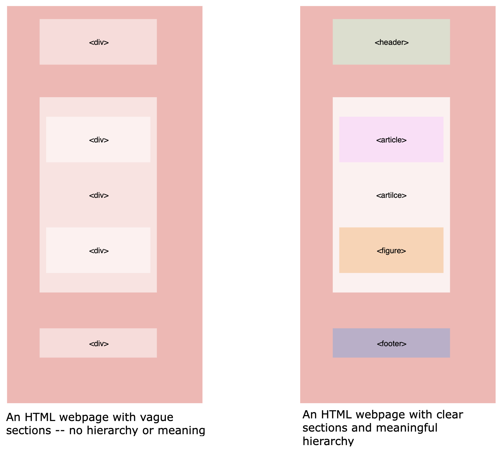
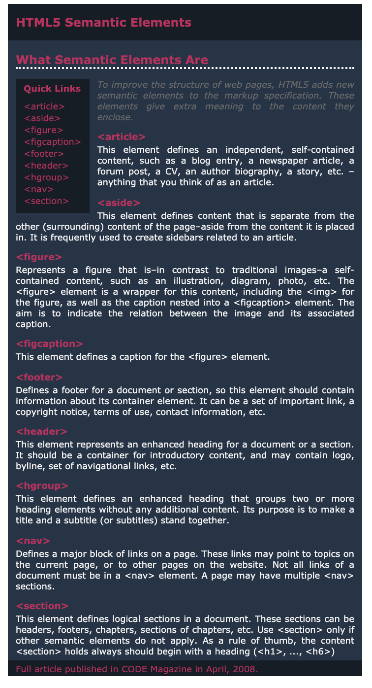

# The Importance of Semantic Markup

Semantic markup is important in structuring your HTML. In this section, we'll learn why we use it when designing meaningful webpages.
Let's begin!

## What is semantic markup in web design?

Semantic markup is a method of writing and formatting the HTML (Hypertext Markup Language) to emphasize the semantic meaning, or purpose of the content, as opposed to its appearance.

Semantics and accessibility are part of HTML by architecture but are not useful unless properly implemented. “Semantic markup-ing” means understanding the hierarchy of your web page’s content and how it will be read by both users and machines. Much of that may sound like good judgment; when you write a heading, mark it with a heading tag (`<h1>`, `<h2>`, etc.), and when you write a paragraph you write a paragraph, mark it with a paragraph tag (`<p>`).

```
Semantic markup means that HTML tags are never selected based on how they appear in a web browser-they are selected based on the content’s importance and structure.
```

While HTML has included semantic markup from the beginning, the advent of HTML5 brought with it even more semantic tags such as `<section>`, `<article>`, `<footer>`, `<nav>`, and `<aside>`.

The aim of using semantic markup is to make it simpler for browsers, programmers, and crawlers to differentiate between specific data types. All these semantic tags make it clearer what information is on the web page and how important that information is.

Previously, a website might have been organized using only divs, which didn’t give search engines, crawlers, or other developers any relevant data on what that portion of the site was about.

```
Developers can use semantic markup not only to be clearer about the overall content of their web page, but also to write it in a manner that computers can comprehend
```



## Why is it important

### SEO

Understanding and using semantic markup helps ensure that we hit our target market with relevant content. Search engines assess the value of keywords by placing them in the HTML hierarchy. For example, keywords enclosed in an `<h1>` tag are given more importance than those enclosed in a `<p>` tag.

```
Through putting the most important keywords higher in the list, we are telling search engines what our website is about and why people interested in those particular keywords should be looking at our content.
```

### Accessibility

Since semantic HTML uses elements for a defined intent, reading and interpreting it becomes better for both humans and computers.

Making applications accessible provides equal access for people with disabilities while also helping people without disabilities by empowering them to customize and tailor their experiences.

```
Having a consistent hierarchy for the website allows other resources and software to deliver the content correctly.

```

### Maintenance
Semantic markup means simplified coding. Clear coding is easy to manage. This also ensures that any developer may come along and work on the code without ambiguity because the code is clearly ordered.

Another time-saving advantage of writing semantic HTML is that the web page’s presentation is easier to modify and edit.

Since the content is completely separated from the presentation, without altering the data, you can change the styles or apply styles to multiple data types.

### Summary
Choosing the right HTML isn’t just an intellectual exercise, and it’s always worth exploring whether there’s an HTML feature you might use to represent parts of your content and add meaning to it.

When designing components that concern banners and logos, for example, consider wrapping them in `<header>` rather than `<div>`. If your styling relies upon class names, `<header class= ”header”>` will work just as well as `<div class= ”header”>`.

Semantic HTML can offer other users accessibility advantages, allow your work to be future proof, theoretically improve your search engine rankings, and allow people with disabilities to access your content on the web.

### Practice
Your task is to make use of semantic elements in HTML5 to create the web page as shown below:



#### Helpful information
The following information on semantic tags may prove useful for this purpose:

`<article>` This element defines an independent, self-contained content like a blog entry, a newspaper article, a forum post, a CV, an author biography, a story, etc. – anything that you think of as an article.

`<aside>` This element defines content that is separate from the other (surrounding) content of the page, aside from the content it is placed in. It is frequently used to create sidebars related to an article.

`<figure>` This element represents a figure that is a self-contained content, such as an illustration, diagram, photo, etc. The `<figure>` element is a wrapper for this content, including the `` for the figure, as well as the caption nested into a `<figcaption>` element. The aim is to indicate the relation between the image and its associated caption.

`<figcaption>` This element defines a caption for the `<figure>` element.

`<footer>` This element defines a footer for a document or section, so this element should contain information about its container element. It can be a set of important links, a copyright notice, terms of use, contact information, etc.

`<header>` This element represents an enhanced heading for a document or a section. It should be a container for introductory content, and it may contain logo, byline, set of navigational links, etc.

`<hgroup>` This element defines an enhanced heading that groups two or more heading elements without any additional content. Its purpose is to make a title and a subtitle (or subtitles) stand together.

`<nav>` This element defines a major block of links on a page. These links may point to topics on the current page, or to other pages on the website. Not all links of a document must be in a `<nav>` element. A page may have multiple `<nav>` sections.

`<section>` This element defines logical sections in a document. These sections can be headers, footers, chapters, sections of chapters, etc. Use `<section>` only if other semantic elements do not apply. As a rule of thumb, the content `<section>` holds always should begin with a heading (`<h1>`, ..., `<h6>`).