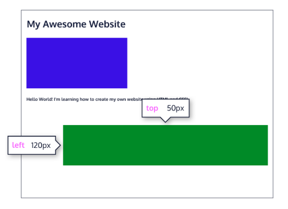
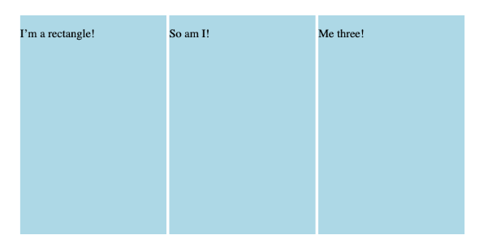
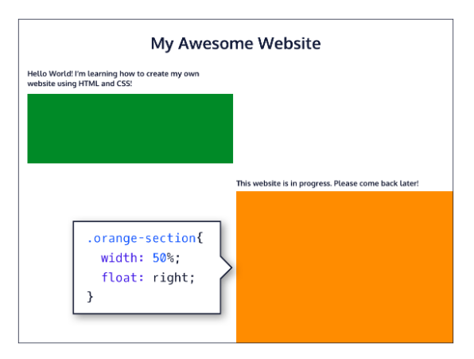

# Display and Positioning.

## 1. Position

Take a look at the block-level elements in the image below:


Block-level elements like these boxes create a block the full width of their parent elements, and they prevent other elements from appearing in the same horizontal space.

Notice the block-level elements in the image above take up their own line of space and therefore don’t overlap each other. In the browser to the right, you can see block-level elements also consistently appear on the left side of the browser. This is the default position for block-level elements.

The default position of an element can be changed by setting its `position` property. The `position` property can take one of five values:

- `static` - the default value (it does not need to be specified)
- `relative`
- `absolute`
- `fixed`
- `sticky`

### A. Position: Relative

One way to modify the default position of an element is by setting its `position` property to `relative`.

This value allows you to position an element relative to its default static position on the web page.

```css
.green-box {
  background-color: green;
  position: relative;
}
```

Although the code in the example above instructs the browser to expect a relative positioning of the `.green-box` element, it does not specify where the `.green-box` element should be positioned on the page. This is done by accompanying the `position` declaration with one or more of the following offset properties that will move the element away from its default static position:

- `top` - moves the element down from the top.
- `bottom` - moves the element up from the bottom.
- `left` - moves the element away from the left side (to the right).
- `right` - moves the element away from the right side (to the left).

You can specify values in pixels, ems, or percentages, among others, to dial in exactly how far you need the element to move. It’s also important to note that offset properties will not work if the element’s `position` property is the default `static`.

```css
.green-box {
  background-color: green;
  position: relative;
  top: 50px;
  left: 120px;
}
```

In the example above, the element of `green-box` class will be moved down 50 pixels, and to the right 120 pixels, from its default static position. The image below displays the new position of the box.



Offsetting the relative element will not affect the positioning of other elements.

### B. Position: Absolute

Another way of modifying the position of an element is by setting its position to `absolute`.

When an element’s position is set to `absolute`, all other elements on the page will ignore the element and act like it is not present on the page. The element will be positioned relative to its closest positioned parent element, while offset properties can be used to determine the final position from there. Take a look at the image below:


The “Website building in progress. Please come back later!” text is displaced from its static position at the top left corner of its parent container. It has offset property declarations of `top: 300px;` and `right: 0px;`, positioning it 300 pixels down, and 0 pixels from the right side of the page.

## C. Position: Fixed

When an element’s position is set to `absolute`, as in the last exercise, the element will scroll with the rest of the document when a user scrolls.

We can fix an element to a specific position on the page (regardless of user scrolling) by setting its position to `fixed`, and accompanying it with the familiar offset properties `top`, `bottom`, `left`, and `right`.

```css
.title {
  position: fixed;
  top: 0px;
  left: 0px;
}
```

In the example above, the `.title` element will remain `fixed` to its position no matter where the user scrolls on the page.

This technique is often used for navigation bars on a web page.

### D. Position: Sticky

Since `static` and `relative` positioned elements stay in the normal flow of the document, when a user scrolls the page (or parent element) these elements will scroll too. And since `fixed` and `absolute` positioned elements are removed from the document flow, when a user scrolls, these elements will stay at their specified offset position.

The `sticky` value is another position value that keeps an element in the document flow as the user scrolls, but sticks to a specified position as the page is scrolled further. This is done by using the `sticky` value along with the familiar offset properties, as well as one new one.

```css
.box-bottom {
  background-color: darkgreen;
  position: sticky;
  top: 240px;
}
```

In the example above, the `.box-bottom` `<div>` will remain in its relative position, and scroll as usual. When it reaches 240 pixels from the top, it will stick to that position until it reaches the bottom of its parent container where it will “unstick” and rejoin the flow of the document.

## 2. Z-Index

When boxes on a web page have a combination of different positions, the boxes (and therefore, their content) can overlap with each other, making the content difficult to read or consume.

```css
.blue-box {
  background-color: blue;
}

.green-box {
  background-color: green;
  position: relative;
  top: -170px;
  left: 170px;
}
```

In the example above, the `.green-box` element overlaps on top of the `.blue-box` element.

The `z-index` property controls how far back or how far forward an element should appear on the web page when elements overlap. This can be thought of as the depth of elements, with deeper elements appearing behind shallower elements.

The `z-index` property accepts integer values. Depending on their values, the integers instruct the browser on the order in which elements should be layered on the web page.

```css
.blue-box {
  background-color: blue;
  position: relative;
  z-index: 1;
}

.green-box {
  background-color: green;
  position: relative;
  top: -170px;
  left: 170px;
}
```

In the example above, we set the `.blue-box` position to `relative` and the `z-index` to 1. We changed position to `relative`, because the `z-index` property does not work on `static` elements. The `z-index` of 1 moves the .blue-box element forward, because the `z-index` value has not been explicitly specified for the `.green-box` element, which means it has a default `z-index` value of 0. Take a look the example image below:


## 3. Inline Display

Every HTML element has a default `display` value that dictates if it can share horizontal space with other elements. Some elements fill the entire browser from left to right regardless of the size of their content. Other elements only take up as much horizontal space as their content requires and can be directly next to other elements.

In this lesson, we’ll cover three values for the display property: `inline`, `block`, and `inline-block`.

The default display for some elements, such as `<em>`, `<strong>`, and `<a>`, is called inline. Inline elements have a box that wraps tightly around their content, only taking up the amount of space necessary to display their content and not requiring a new line after each element. The height and width of these elements cannot be specified in the CSS document. For example, the text of an anchor tag (`<a>`) will, by default, be displayed on the same line as the surrounding text, and it will only be as wide as necessary to contain its content. `inline` elements cannot be altered in size with the `height` or `width` CSS properties.

```html
To learn more about <em>inline</em> elements, read
<a href="#">MDN documentation</a>.
```

In the example above, the `<em>` element is `inline`, because it displays its content on the same line as the content surrounding it, including the anchor tag. This example will display:

The CSS `display` property provides the ability to make any element an inline element. This includes elements that are not inline by default such as paragraphs, divs, and headings.

```css
h1 {
  display: inline;
}
```

The CSS in the example above will change the display of all `<h1>` elements to inline. The browser will render `<h1>` elements on the same line as other `inline` elements immediately before or after them (if there are any).

## 4. Display: Block

Some elements are not displayed in the same line as the content around them. These are called block-level elements. These elements fill the entire width of the page by default, but their `width` property can also be set. Unless otherwise specified, they are the height necessary to accommodate their content.

Elements that are block-level by default include all levels of heading elements (`<h1>` through `<h6>`), `<p>`, `<div>` and `<footer>`.

```css
strong {
  display: block;
}
```

In the example above, all `<strong>` elements will be displayed on their own line, with no content directly on either side of them even though their contents may not fill the width of most computer screens.

## 5. Display: Inline-Block

The third value for the `display` property is `inline-block`. Inline-block display combines features of both inline and block elements. Inline-block elements can appear next to each other and we can specify their dimensions using the `width` and `height` properties. Images are the best example of default inline-block elements.

For example, the `<div>`s below will be displayed



Let’s take a look at the code:

```html
<div class="rectangle">
  <p>I’m a rectangle!</p>
</div>
<div class="rectangle">
  <p>So am I!</p>
</div>
<div class="rectangle">
  <p>Me three!</p>
</div>
```

```css
.rectangle {
  display: inline-block;
  width: 200px;
  height: 300px;
}
```

There are three rectangular divs that each contain a paragraph of text. The `.rectangle` `<div>`s will all appear inline (provided there is enough space from left to right) with a width of 200 pixels and height of 300 pixels, even though the text inside of them may not require 200 pixels by 300 pixels of space.

## 6. Float

So far, you’ve learned how to specify the exact position of an element using offset properties. If you’re simply interested in moving an element as far left or as far right as possible in the container, you can use the `float` property.

The float property is commonly used for wrapping text around an image. Note, however, that moving elements left or right for layout purposes is better suited for tools like CSS grid and flexbox, which you’ll learn about later on.

The `float` property is often set using one of the values below:

- `left` - moves, or floats, elements as far left as possible.
- `right` - moves elements as far right as possible.

```css
.green-section {
  width: 50%;
  height: 150px;
}

.orange-section {
  background-color: orange;
  width: 50%;
  float: right;
}
```

In the example above, we float the `.orange-section` element to the `right`. This works for static and relative positioned elements. See the result of the code below:



Floated elements must have a width specified, as in the example above. Otherwise, the element will assume the full width of its containing element, and changing the float value will not yield any visible results.

## 7. Clear

The `float` property can also be used to float multiple elements at once. However, when multiple floated elements have different heights, it can affect their layout on the page. Specifically, elements can “bump” into each other and not allow other elements to properly move to the left or right.

The `clear` property specifies how elements should behave when they bump into each other on the page. It can take on one of the following values:

- `left` —the left side of the element will not touch any other element within the same containing element.
- `right` —the right side of the element will not touch any other element within the same containing element.
- `both` —neither side of the element will touch any other element within the same containing element.
- `none` —the element can touch either side.

```css
div {
  width: 200px;
  float: left;
}

div.special {
  clear: left;
}
```

In the example above, all `<div>`s on the page are floated to the left side. The element with class `special` did not move all the way to the left because a taller `<div>` blocked its positioning. By setting its `clear` property to left, the `special` `<div>` will be moved all the way to the `left` side of the page.
