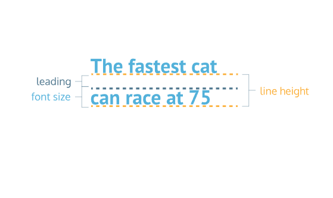

# Typography

In this lesson, we’ll focus on typography, the art of arranging text on a page. We’ll look at:

- How to style and transform fonts.
- How to lay text out on a page.
- and how to add external fonts to your web pages.

## 1.Font Family

You may remember from the Visual Rules lesson that the font of an element can be changed using the font-family property.

```css
h1 {
  font-family: Arial;
}
```

In the example above, the font family for all `<h1>` heading elements have been set to `Arial`.

Let’s talk about some things to keep in mind when setting `font-family` values.

**Multi-Word Values**
When specifying a typeface with multiple words, like Times New Roman, it is recommended to use quotation marks `(' ')` to group the words together, like so:

```css
h1 {
  font-family: "Times New Roman";
}
```

**Web Safe Fonts**

There is a selection of fonts that will appear the same across all browsers and operating systems. These fonts are referred to as web safe fonts.

**Fallback Fonts and Font Stacks**

Web safe fonts are good fallback fonts that can be used if your preferred font is not available.

```css
h1 {
  font-family: Caslon, Georgia, "Times New Roman";
}
```

In the example above, Georgia and Times New Roman are fallback fonts to Caslon. When you specify a group of fonts, you have what is known as a font stack. A font stack usually contains a list of similar-looking fonts. Here, the browser will first try to use the Caslon font. If that’s not available, it will try to use a similar font, Georgia. And if Georgia is not available, it will try to use Times New Roman.

**Serif and Sans-Serif**

You may be wondering what features make a font similar to another font. The fonts Caslon, Georgia, and Times New Roman are Serif fonts. Serif fonts have extra details on the ends of each letter, as opposed to Sans-Serif fonts, which do not have the extra details.


`serif` and `sans-serif` are also keyword values that can be added as a final fallback font if nothing else in the font stack is available.

```css
h1 {
  font-family: Caslon, Georgia, "Times New Roman", serif;
}
```

In this final example, the font stack has 4 fonts. If the first 3 fonts aren’t available, the browser will use whatever serif font is available on the system.

## 2.Font Weight

In CSS, the `font-weight` property controls how bold or thin text appears. It can be specified with keywords or numerical values.

**Keyword Values**

The `font-weight` property can take any one of these keyword values:

- `bold`: Bold font weight.
- `normal`: Normal font weight. This is the default value.
- `lighter`: One font weight lighter than the element’s parent value.
- `bolder`: One font weight bolder than the element’s parent value

**Numerical Values**

Numerical values can range from 1 (lightest) to 1000 (boldest), but it is common practice to use increments of 100. A font weight of `400` is equal to the keyword value `normal`, and a font weight of `700` is equal to `bold`.

```css
.left-section {
  font-weight: 700;
}

.right-section {
  font-weight: bold;
}
```

In the example above, text in elements of both `.left-section` and `.right-section` classes will appear bold.

It’s important to note that not all fonts can be assigned a numeric font weight, and not all numeric font weights are available to all fonts. It’s a good practice to look up the font you are using to see which `font-weight` values are available.

## 3.Font Style

You can also italicize text with the font-style property.

```css
h3 {
  font-style: italic;
}
```

The `italic` value causes text to appear in italics. The `font-style` property also has a `normal` value which is the default.

## 4.Text Transformation

Text can also be styled to appear in either all uppercase or lowercase with the `text-transform` property.

```css
h1 {
  text-transform: uppercase;
}
```

The code in the example above formats all `<h1>` elements to appear in `uppercase`, regardless of the case used for the heading within the HTML code. Alternatively, the `lowercase` value could be used to format text in all lowercase.

Since text can be directly typed in all uppercase or lowercase within an HTML file, what is the point of a CSS rule that allows you to format letter case?

Depending on the type of content a web page displays, it may make sense to always style a specific element in all uppercase or lowercase letters. For example, a website that reports breaking news may decide to format all `<h1>` heading elements such that they always appear in all uppercase, as in the example above. It would also avoid uppercase text in the HTML file, which could make code difficult to read.

## 5.Text Layout

You’ve learned how text can be defined by font family, weight, style, and transformations. Now you’ll learn about some ways text can be displayed or laid out within the element’s container.

Letter Spacing
The `letter-spacing` property is used to set the horizontal spacing between the individual characters in an element. It’s not common to set the spacing between letters, but it can sometimes help the readability of certain fonts or styles. The `letter-spacing` property takes length values in units, such as `2px` or `0.5em`.

```css
p {
  letter-spacing: 2px;
}
```

In the example above, each character in the paragraph element will be separated by 2 pixels.

**Word Spacing**

You can set the space between words with the `word-spacing` property. It’s also not common to increase the spacing between words, but it may help enhance the readability of bolded or enlarged text. The`word-spacing`property also takes length values in units, such as `3px` or `0.2em`.

```css
h1 {
  word-spacing: 0.3em;
}
```

In the example above, the word spacing is set to `0.3em`. For word spacing, using `em` values are recommended because the spacing can be set based on the size of the font.

**Line Height**



We can use the `line-height` property to set how tall we want each line containing our text to be. Line height values can be a unitless number, such as `1.2`, or a length value, such as `12px`, `5%` or `2em`.

```css
p {
  line-height: 1.4;
}
```

In the example above, the height between lines is set to `1.4`. Generally, the unitless value is preferred since it is responsive based on the current font size. In other words, if the `line-height` is specified by a unitless number, changing the font size will automatically readjust the line height.

**Text Alignment**

The `text-align` property, which you may already be familiar with from the CSS Visual Rules lesson, aligns text to its parent element.

```css
h1 {
  text-align: right;
}
```

In the example above, the `<h1>` element is aligned to the right side, instead of the default left.
