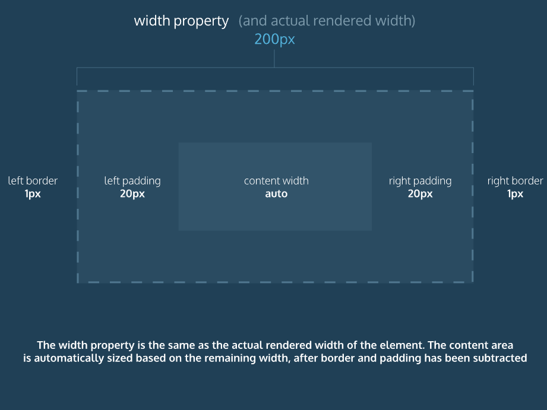

## 1. Why Change the Box Model?

The last lesson focused on the most important aspects of the box model: box dimensions, borders, padding, and margin.

The box model, however, has an awkward limitation regarding box dimensions. This limitation is best illustrated with an example.

```html
<h1>Hello World</h1>
```

```css
h1 {
  border: 1px solid black;
  height: 200px;
  width: 300px;
  padding: 10px;
}
```

In the example above, a heading element’s box has solid, black, 1 pixel thick borders. The height of the box is 200 pixels, while the width of the box is 300 pixels. A padding of 10 pixels has also been set on all four sides of the box’s content.

Unfortunately, under the current box model, the border thickness and the padding will affect the dimensions of the box.

The 10 pixels of padding increases the height of the box to 220 pixels and the width to 320 pixels. Next, the 1-pixel thick border increases the height to 222 pixels and the width to 322 pixels.

Under this box model, the border thickness and padding are added to the overall dimensions of the box. This makes it difficult to accurately size a box. Over time, this can also make all of a web page’s content difficult to position and manage.

## 2. Box Model: Content-Box


Many properties in CSS have a default value and don’t have to be explicitly set in the stylesheet.

For example, the default `font-weight` of text is `normal`, but this property-value pair is not typically specified in a stylesheet.

The same can be said about the box model that browsers assume. In CSS, the `box-sizing` property controls the type of box model the browser should use when interpreting a web page.

The default value of this property is `content-box`. This is the same box model that is affected by border thickness and padding.

## 3. Box Model: Border-Box



Fortunately, we can reset the entire box model and specify a new one: `border-box`.

```css
* {
  box-sizing: border-box;
}
```

The code in the example above resets the box model to `border-box` for all HTML elements. This new box model avoids the dimensional issues that exist in the former box model you learned about.

In this box model, the height and width of the box will remain fixed. The border thickness and padding will be included inside of the box, which means the overall dimensions of the box do not change.

```html
<h1>Hello World</h1>
```

```css
* {
  box-sizing: border-box;
}

h1 {
  border: 1px solid black;
  height: 200px;
  width: 300px;
  padding: 10px;
}
```

In the example above, the height of the box would remain at 200 pixels and the width would remain at 300 pixels. The border thickness and padding would remain entirely inside of the box.

## 4. The New Box Model

Now that you know about the new box model, let’s actually implement it.

```css
* {
  box-sizing: border-box;
}
```

It’s that simple! In the example above, the universal selector `(*)` targets all elements on the web page and sets their box model to the `border-box` model.
